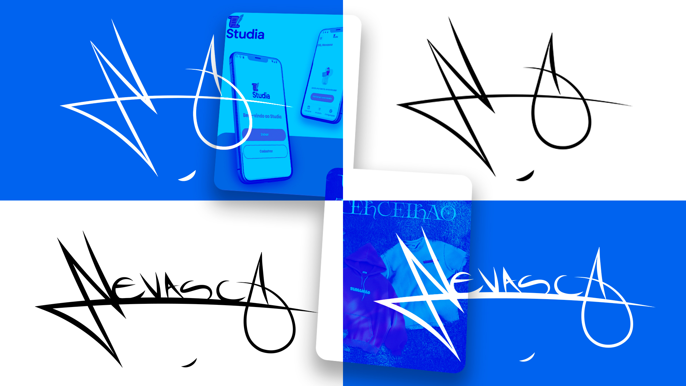

# Portfólio Pessoal

Este portfólio reúne projetos desenvolvidos ao longo da minha trajetória acadêmica e prática na área de design e desenvolvimento, destacando habilidades em criação visual, interfaces, animações e soluções digitais. Cada projeto reflete o processo criativo, o estudo de referências e a aplicação de conhecimentos técnicos, com foco em estética, funcionalidade e experiência do usuário.

---

Projeto realizado por:

- Lucas (Nevasca) Merini Flores  
